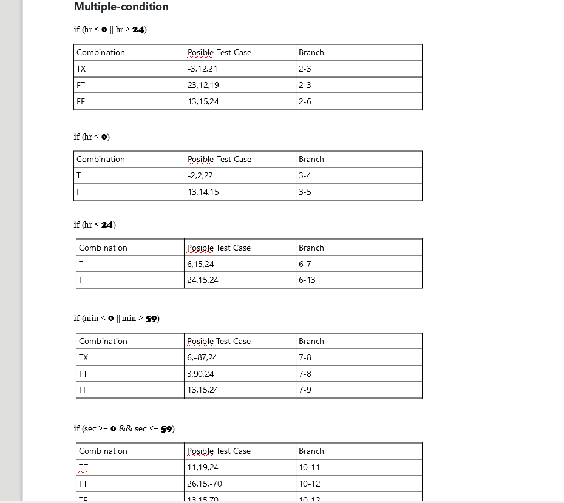

# SI_lab2_193104

Control Flow Graph (slika)
.png "CFG")

Цикломатска комплексност
Цикломатската комплексност на процесот е 8, која е добиена преку P+1 каде предикати се: 1.2,2,3,6,7,9
Цикломатската комплексност може да ја добиеме  и преку  формулата E – N + 2, каде Е = бројот на ребра, 
а N = бројот на јазли. 
Во овој случај Е = 25 и N = 19, па добиваме 25 – 19 + 2 = 8.

EveryBranch 

.png "EverBranch1")
.png "EverBranch2")

MultipleCondition

.png "MC2")

